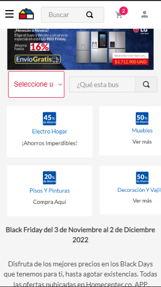

📢 Use this project, [contribute](https://github.com/{OrganizationName}/{AppName}) to it or open issues to help evolve it using [Store Discussion](https://github.com/vtex-apps/store-discussion).

<!-- DOCS-IGNORE:start -->
<!-- ALL-CONTRIBUTORS-BADGE:START - Do not remove or modify this section -->
[](#contributors-)
<!-- ALL-CONTRIBUTORS-BADGE:END -->
<!-- DOCS-IGNORE:end -->

# Bullets Diagramation

Component that allows the creation of bullets that target different categories. 



## Configuration 

Next I will explain how to have the Bullet Component in the store theme:

1. Import the Bullet's app to your theme's dependencies in the `manifest.json`, for example:

```
  dependencies: {
    "itgloberspartnercl.bullets-diagramation": "0.x"
  }
```

2. Add the `list-context.bullet-group` block to the Product template. For example:
```
  "list-context.bullet-group": {
    "props": {
      "image": "String",
      "titleBullet": "String",
      "link?":{
        "url": "String"
        "attributeNofollow?": "boolean"
        "attributeTitle?": "String"
        "openNewTab?": "boolean"
        "newTab?": "boolean"
      }
  }
```

| Props Name    | Type   | Description                                                                                                                     | Default Value |
|---------------|--------|---------------------------------------------------------------------------------------------------------------------------------|---------------|
| "image"       | String | Add the image that you want.                                                                                                    | none          |
| "titleBullet" | String | Give a Title to the bullet.                                                                                                     | "Bullet"      |
| "link"        | Object | titleThis property is optional, if you want the user to be redirected to a link you have the option of putting it as an object. | none          |

For the prop `"link"` you have the next props:

| Props Name          | Type    | Description                                                                                                                                 | Default Value |
|---------------------|---------|---------------------------------------------------------------------------------------------------------------------------------------------|---------------|
| "url"               | String  | Add an internal or external link for your store theme.                                                                                      | none          |
| "attributeNofollow" | Boolean | Optional. Guides the search engine not to track the link of the page indicated by the tag. If true sets rel=noFollow attribute to the link. | false         |
| "attributeTitle"    | String  | Optional. Add a title for the link.                                                                                                         | none          |
| "openNewTab"        | Boolean | Optional. Open the link in a new tab.                                                                                                       | false               |
| "newTab"            | Boolean | Optional. Open the link in a new page.                                                                                                      | false              |

## Customization

In order to apply CSS customizations in this and other blocks, follow the instructions given in the recipe on [Using CSS Handles for store customization](https://vtex.io/docs/recipes/style/using-css-handles-for-store-customization).

| CSS Handles |
| ----------- | 
| `bullet__container` | 
| `bullet__item` | 
| `bullet__item--image` | 
| `bullet__item--link` | 
| `bullet__item--title` |


<!-- DOCS-IGNORE:start -->

## Contributors ✨

Thanks goes to these wonderful people:

<!-- ALL-CONTRIBUTORS-LIST:START - Do not remove or modify this section -->
<!-- prettier-ignore-start -->
<!-- markdownlint-disable -->
<!-- markdownlint-enable -->
<!-- prettier-ignore-end -->
<!-- ALL-CONTRIBUTORS-LIST:END -->

This project follows the [all-contributors](https://github.com/all-contributors/all-contributors) specification. Contributions of any kind are welcome!

<!-- DOCS-IGNORE:end -->

---- 

Check out some documentation models that are already live: 
- [Breadcrumb](https://github.com/vtex-apps/breadcrumb)
- [Image](https://vtex.io/docs/components/general/vtex.store-components/image)
- [Condition Layout](https://vtex.io/docs/components/all/vtex.condition-layout@1.1.6/)
- [Add To Cart Button](https://vtex.io/docs/components/content-blocks/vtex.add-to-cart-button@0.9.0/)
- [Store Form](https://vtex.io/docs/components/all/vtex.store-form@0.3.4/)
